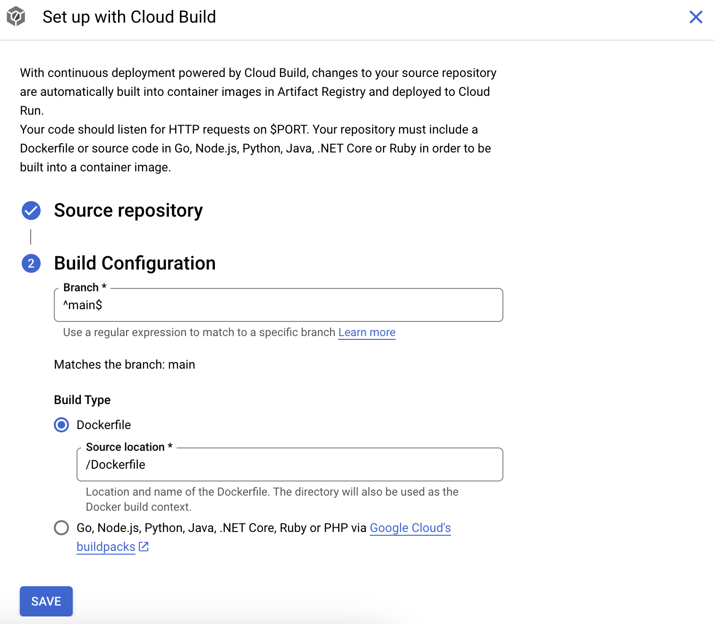
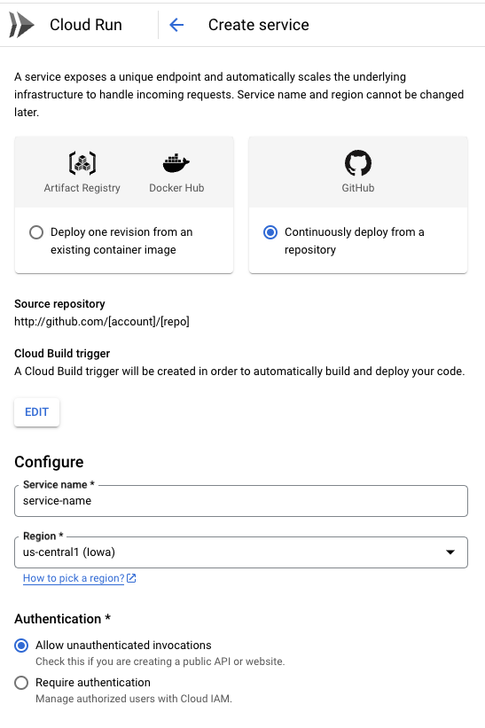

**Deploying a Go Application to Google Cloud**

For businesses, maintaining competitiveness and productivity is paramount. When embarking on application development, efficiency in scaling, cost reduction, rapid innovation, and ensuring reliability and security are top priorities. For Go developers, Google Cloud Platform (GCP) offers a comprehensive suite of tools and services tailored for deploying and managing applications efficiently.

In this post, I'll show you how to set up TODOx(a to-do application written in Go & HTMX) using Google Cloud Build, ensuring that changes to the repository of the application are automatically built into container images in Artifact Registry and deployed to Cloud Run.

**Before proceeding**

Let's address a question you may have: What are the benefits of deploying applications to Google Cloud Run?

The following are some of the ones I would highlight:

- **Fully Managed Serverless Platform:** Cloud Run provides a fully managed serverless environment, freeing you from the infrastructure management. This allows you to focus on developing and deploying your applications.

- **Containerized Workloads:** Cloud Run supports containerized workloads, which gives you flexibility and portability in how you build and deploy your applications.

- **Automatic Scaling:** Cloud Run automatically scales your applications based on incoming requests, which can help you save on costs by only paying for resources when they're in use.

- **Pay-per-use Billing:** It means you only pay for the resources your application consumes, billed by the number of requests and the duration of each request.

**Let's move on**

**Step 1: Deploying our Web Application**

As previously stated, we will use TODOx for our demonstration. So we will create a service, and link it to the repository where TODOx is hosted.

Log into "Google Cloud Console", go to "Google Run" through the navigation menu, and click "Create Service".

Next, choose the option “Github - Continuously deploy from a repository.”, and click "Set up with cloud build".

In the "Set up with Cloud Build" screen, choose the repository you have created previously, choose the branch on which the deployments will be based, choose "Dockerfile" as your "Build Type", set the source location, and click  "Save".

 

Finally, define a service name and description, choose an authentication option, and click "Create".

 

That's all.

Now, you only need to wait a few minutes until the deployment is completed.

**Conclusion**

Once the service is created, a first deployment is done automatically. The URL of the application will be visible in the "Cloud Run Service Details" screen. Keep in mind that every change pushed to the "main" branch into the Github repository will trigger an action that runs linters to look for issues in the Go code. This is why you had implemented "Github Actions" that is a continuous integration and continuos delivery (CI/CD) platform. Also, every change pushed to the "main" branch will trigger a new deployment, so you probably want to add some restrictions here to manage a bit better when a new version of your application should be deployed.

This is just a small sample of all you could do with Go, and technologies like "Google Cloud", "Docker", and "Github".

Nothing more to add for the moment, thanks for reading!