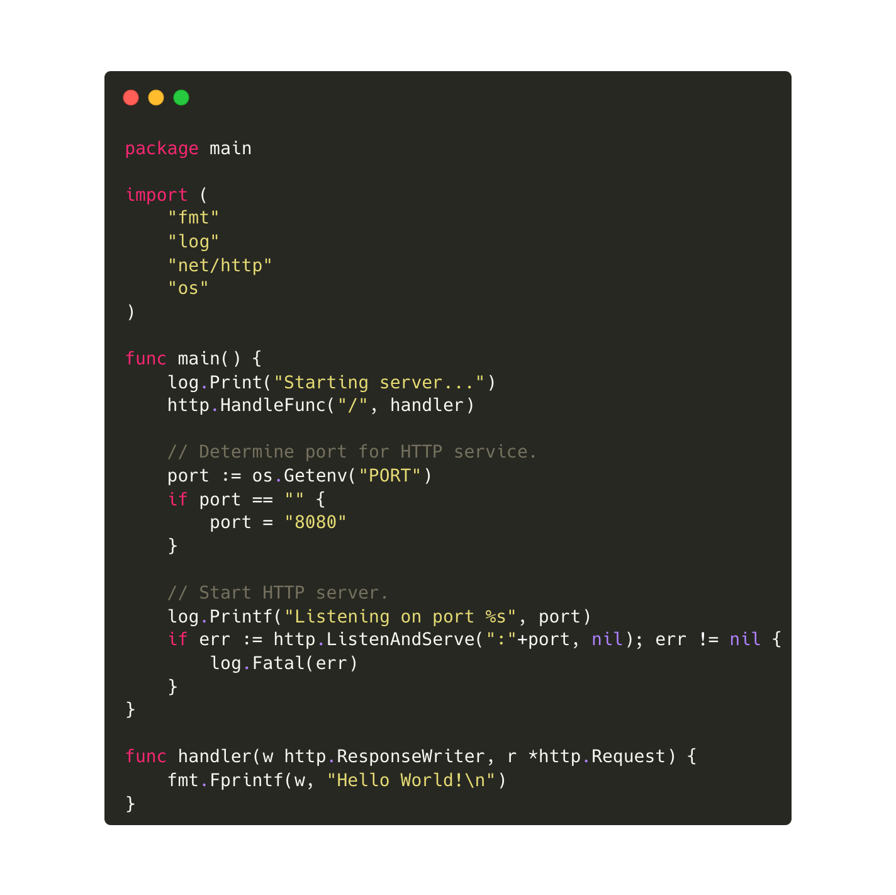
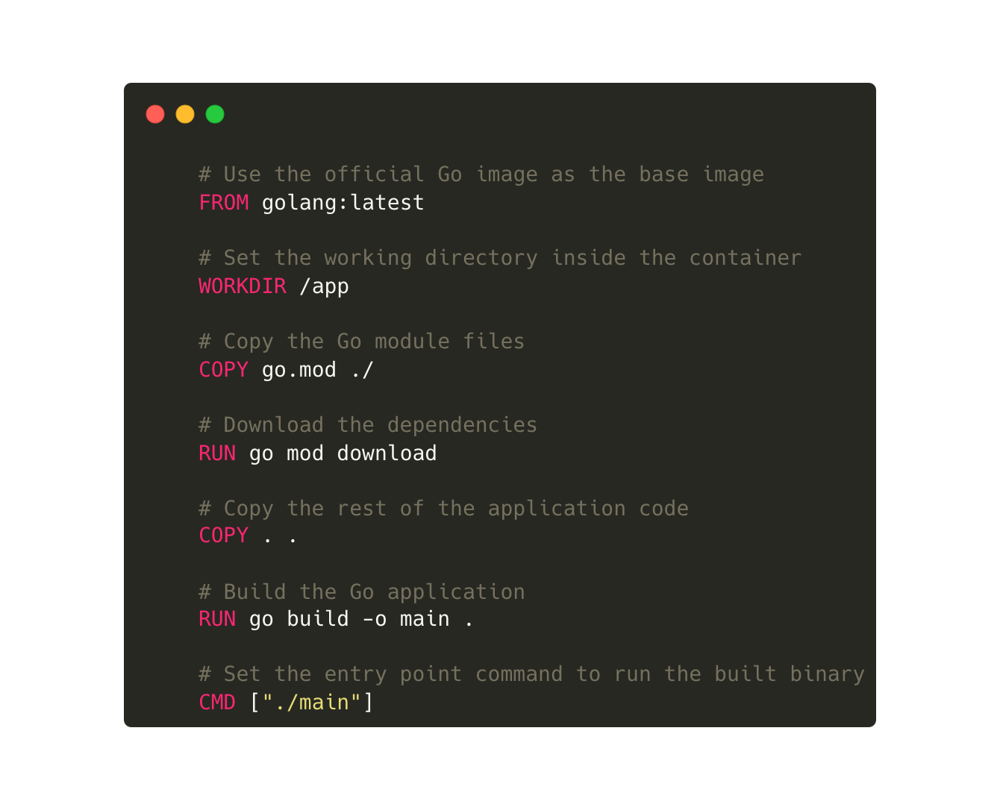
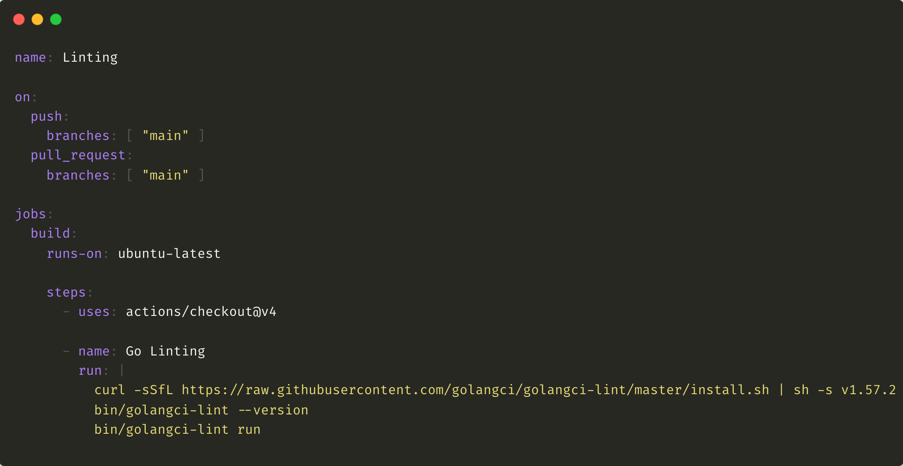

**Deploy a Go Application to Google Cloud**

In this post, I'll show you how to set up a Go application using Cloud Build, ensuring that changes to your source repository are automatically built into container images in Artifact Registry and deployed to Cloud Run.

At the conclusion of this post, assuming you are going to diligently follow each step, you should have set up a Google Cloud Platform project, a service, and a GitHub repository to host your Go codebase.

So, have into account that you need:
- Go installed.
- Project on Google Cloud Platform.
- Billing account for your project.

Now, let's move on.

**Writing a Go app**

In your GoPath, create an “example” directory, and an “app” subdirectory.

Create a “main.go” in the “app” directory.

 

Create a Dockerfile.

 

Then, create a ".github/workflows" directory. The directory must have this exact name in order for Github to detect any Github Actions workflows that it contains.

In the ".github/workflows" directory, create a file with the ".yml" extension.

 

And finally, enable dependency tracking, with the following command:

    go mod init example/app

**Creating a repository**

Create a Github repository.

Now, from your local machine, create a new repository, with the following commands:

    cd example/app
    echo "# repository name" >> README.md
    git init
    git add .
    git commit -m "first commit"
    git branch -M main
    git remote add origin https://github.com/[account_name]/[repository_name].git
    git push -u origin main

**Creating a service**

In Cloud Run, create a service.

Set a name, and description.

Choose the option “Github - Continuously deploy from a repository.”

Set up with Cloud Build.

- Choose the repository you have created previously.
- Choose a branch.
- And choose “Dockerfile” as your “Build Type”, and set the source location.

That's all.

Now, you only need to wait a few minutes until the deployment is completed.

Thanks for reading.